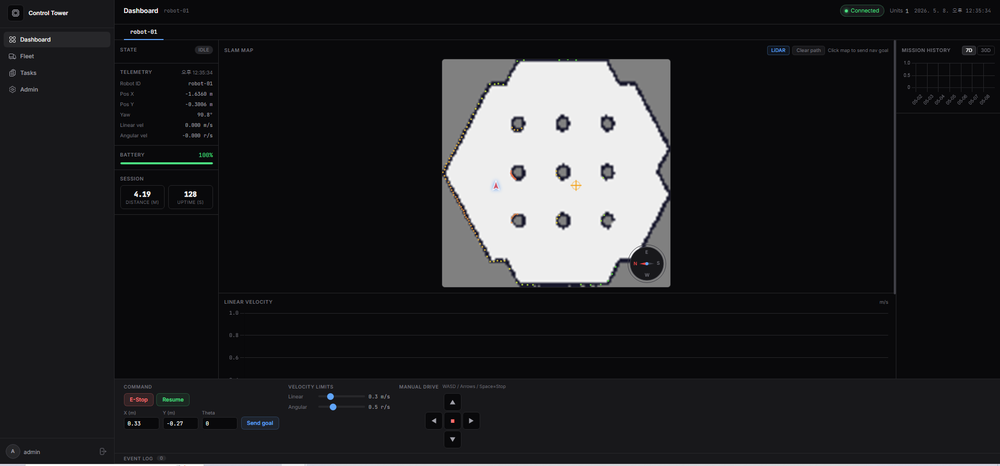
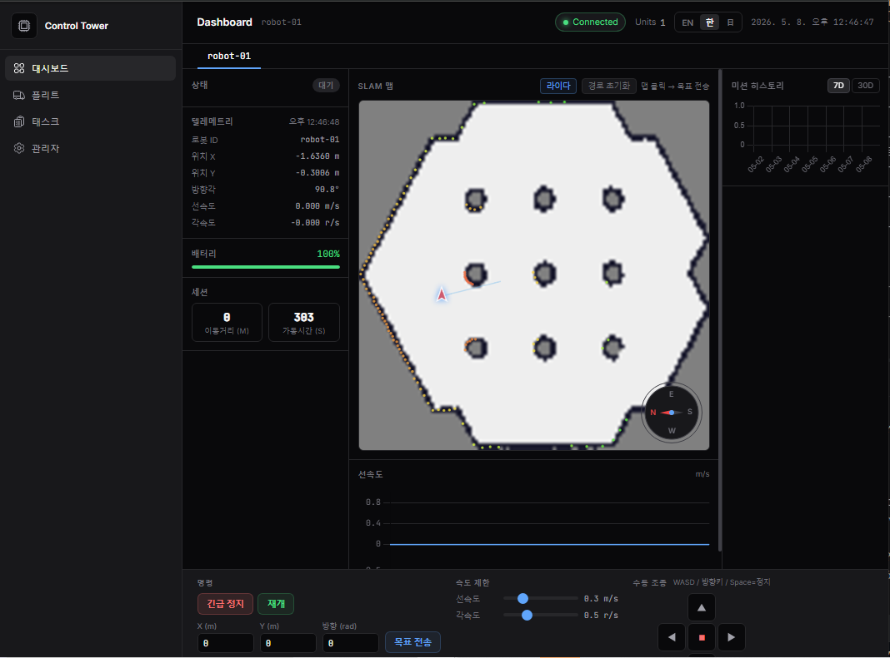
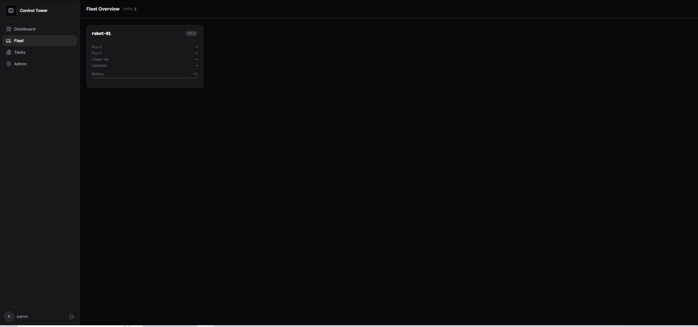
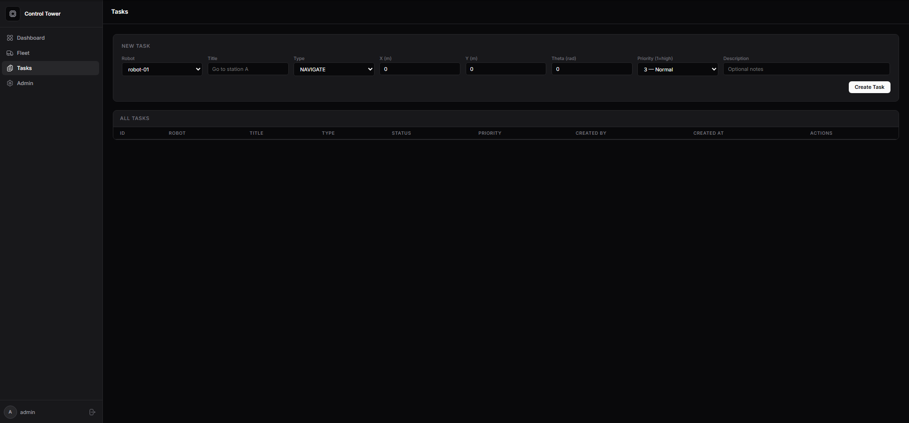
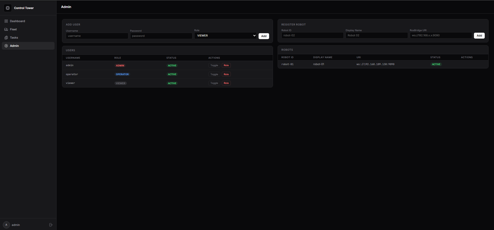

# AMR Control Tower

AMR(Autonomous Mobile Robot) 실시간 모니터링·제어 Fleet 관제 대시보드입니다.
ROS2 rosbridge를 통해 로봇 상태를 수집하고, WebSocket(STOMP)으로 대시보드에 실시간 반영합니다.
Spring Security RBAC 인증, Task 관리, 다국어(EN/KO/JA) 지원을 포함합니다.

---

## 화면 미리보기

### 대시보드 (영어)
> SLAM 맵 실시간 오버레이 + LiDAR 스캔 + 로봇 위치 추적 + 언어 선택(EN/KO/JA)



### 대시보드 (한국어)
> 언어 선택기로 전체 UI를 한국어로 전환 — 모든 레이블·버튼·상태 텍스트 실시간 교체



### Fleet Overview
> 전체 로봇 카드 그리드 — 개별 상태·위치·배터리 실시간 표시



### Task Management
> 네비게이션 태스크 생성·조회·실행 — 우선순위·타입·좌표 설정



### Admin Panel
> 사용자(ADMIN/OPERATOR/VIEWER) 및 로봇 등록 관리 — ADMIN 전용



---

## 주요 기능

### 실시간 모니터링
- **SLAM 맵 오버레이** — slam_toolbox OccupancyGrid를 PNG로 렌더링, 5초 주기 업데이트
- **LiDAR 스캔 시각화** — `/scan` 토픽 실시간 포인트 클라우드 (HSL 거리 색상 코딩)
- **로봇 위치 추적** — `/tf` map→odom 변환 적용으로 정확한 맵 프레임 위치
- **방향 화살표** — quaternion → yaw 변환, 캔버스 좌표계 보정
- **나침반 위젯** — 실시간 yaw 기반 N/E/S/W 방위 표시
- **속도 추이 차트** — 최근 60초 선속도 실시간 라인 차트
- **배터리 상태** — 실시간 잔량 바 + 20% 이하 이벤트 자동 발행
- **멀티 로봇 탭** — 로봇별 탭 전환으로 독립 모니터링

### 로봇 제어
- **D-Pad 조이스틱** — 마우스 클릭 + 터치 지원 방향 제어
- **WASD / 방향키** — 키보드 실시간 `/cmd_vel` 발행 (100ms 루프)
- **속도 슬라이더** — 선속도(0.1~1.0 m/s) · 각속도(0.1~1.5 rad/s) 동적 조절
- **맵 클릭 → Nav2 목표** — Canvas 좌표를 world 좌표로 역변환 후 `/goal_pose` 발행
- **긴급 정지 (E-Stop)** — 즉시 zero twist + EMERGENCY_STOP 상태 전환
- **WASD Watchdog** — 브라우저 탭 닫힘·네트워크 단절 시 1.5초 후 자동 zero velocity 전송
- **Resilience4j Circuit Breaker** — 명령 API 장애 격리

### Fleet 관리
- **Fleet 전체 뷰** (`/fleet`) — 전체 로봇 카드 그리드 + 개별 실시간 상태
- **로봇 상태머신** — IDLE / MOVING / EMERGENCY_STOP / CHARGING / ERROR / **OFFLINE**
- **오프라인 자동 감지** — 5초 이상 메시지 없으면 OFFLINE 전환 + 깜빡임 뱃지, 복구 시 자동 IDLE 복귀
- **이벤트 로그** — 배터리 저하, 장애물 감지, YOLO 감지, 목표 도달 실시간 이벤트
- **이벤트 ACK** — 확인 처리 (ackStatus, ackedAt)
- **주간/월간 주행 통계** — 일별 주행 거리 바 차트

### 보안 & 인증 (Phase 4)
- **Spring Security 폼 로그인** — CSRF 보호, 세션 관리
- **RBAC 3단계** — VIEWER(조회) / OPERATOR(제어+태스크) / ADMIN(전체)
- **`@PreAuthorize`** — E-Stop·명령·태스크 API 역할별 접근 제어
- **사용자 관리** — Admin 패널에서 계정 생성·역할 변경·활성화 토글

### Task 관리 (Phase 4)
- **태스크 생성** — Robot·Title·Type(NAVIGATE/CHARGE/CUSTOM)·좌표·우선순위 설정
- **상태머신** — QUEUED → EXECUTING → COMPLETED / FAILED / CANCELLED / PAUSED
- **ROS2 연동** — NAVIGATE 태스크 실행 시 rosbridge로 Nav2 목표 자동 발행
- **우선순위 큐** — Priority 1~5, 낮은 번호가 높은 우선순위

### 다국어 지원 (Phase 4)
- **EN / KO / JA** — 상단 언어 선택기로 전체 UI 언어 실시간 전환
- **localStorage 영구 저장** — 새로고침 후에도 선택 언어 유지
- **data-i18n 속성** — 모든 레이블·버튼·상태 텍스트에 i18n 키 적용

### 알림 & 인프라
- **Slack Webhook 알림** — 배터리 저하(≤20%), 오류, 긴급 정지 시 자동 발송
- **MSA 구조** — Eureka 서비스 디스커버리 + Spring Cloud Gateway
- **Kafka 파이프라인** — 운영 환경 상태·이벤트 스트리밍
- **Prometheus 메트릭** — 배터리·이벤트 커스텀 메트릭 수집
- **YOLO REST 연동** — Python YOLO 노드 감지 결과 POST 수신

---

## 기술 스택

| 영역 | 기술 |
|------|------|
| Backend | Java 21, Spring Boot 3.2.4, Spring WebSocket (STOMP), Spring Data JPA |
| Security | Spring Security 6, thymeleaf-extras-springsecurity6, RBAC (VIEWER/OPERATOR/ADMIN) |
| Frontend | Thymeleaf, Chart.js 4.4, SockJS, STOMP.js, Inter + JetBrains Mono, i18n (EN/KO/JA) |
| Database | H2 (dev), MySQL 8.0 (prod) |
| Message Broker | Apache Kafka 7.6 (Confluent) |
| MSA | Spring Cloud Eureka, Spring Cloud Gateway, Resilience4j |
| ROS2 | ROS2 Humble, rosbridge_suite, slam_toolbox, Nav2, TurtleBot3 Gazebo |
| Observability | Prometheus, Micrometer, Spring Actuator, Slack Webhook 알림 |
| DevOps | Docker, Docker Compose, Gradle 8.8 멀티모듈 |
| API Docs | SpringDoc OpenAPI 3 (Swagger UI `/swagger-ui.html`) |

---

## 아키텍처

```
브라우저 (대시보드 / Fleet 뷰)
    │  STOMP WebSocket  /topic/robot/{id}/*
    ▼
┌──────────────────────────────────────────────────────┐
│  amr-dashboard  :8080                                │
│                                                      │
│  RosBridgeClient ←─── rosbridge :9090 ←── ROS2       │
│    /odom  → onOdom()   → map 프레임 TF 보정          │
│    /scan  → onScan()   → LiDAR 다운샘플 (1/3)        │
│    /map   → onMap()    → OccupancyGrid PNG 변환       │
│    /tf    → onTf()     → map→odom 변환 캐시          │
│    /battery_state → onBattery()                       │
│                                                      │
│  RobotStatusService → STOMP push → 브라우저           │
│  RobotCommandService (CircuitBreaker)                 │
│    → /cmd_vel (D-Pad / WASD)                         │
│    → /goal_pose (맵 클릭 / 폼)           │
│                                                      │
│  MapController → GET /api/robot/{id}/map (PNG)       │
└──────────────────────────────────────────────────────┘
    │ Eureka 등록
    ▼
┌──────────────────┐     ┌──────────────────┐
│  Eureka  :8761   │     │  Gateway  :8000  │  ← 외부 진입점
└──────────────────┘     └──────────────────┘
```

| 프로파일 | DB | Kafka | Eureka | 진입점 |
|---|---|---|---|---|
| dev | H2 인메모리 | 비활성화 | 비활성화 | :8080 직접 |
| prod | MySQL | 활성화 | 활성화 | :8000 Gateway |

---

## 실행 방법

### 로컬 개발 (dev)

```bash
./gradlew bootRun
```

브라우저: `http://localhost:8080`

### Ubuntu ROS2 환경 (Gazebo 연동 시)

```bash
# 터미널 1 — TurtleBot3 Gazebo 실행
export TURTLEBOT3_MODEL=burger
ros2 launch turtlebot3_gazebo turtlebot3_world.launch.py

# 터미널 2 — SLAM toolbox (실시간 맵 생성)
export TURTLEBOT3_MODEL=burger
ros2 launch slam_toolbox online_async_launch.py use_sim_time:=True

# 터미널 3 — Nav2 자율 이동 스택
export TURTLEBOT3_MODEL=burger
ros2 launch nav2_bringup navigation_launch.py use_sim_time:=True

# 터미널 4 — rosbridge WebSocket 서버
ros2 launch rosbridge_server rosbridge_websocket_launch.xml
```

### Docker Compose (prod 풀스택)

```bash
docker compose up --build
```

| 서비스 | 포트 | 역할 |
|--------|------|------|
| api-gateway | **8000** | 외부 진입점 — 라우팅, Circuit Breaker |
| amr-dashboard | 8080 | 대시보드 서비스 본체 |
| eureka-server | 8761 | 서비스 디스커버리 |
| MySQL | 3306 | 상태·이벤트 영구 저장 |
| Kafka | 9092 | 로봇 상태 이벤트 스트리밍 |

---

## 기본 계정

| 계정 | 비밀번호 | 역할 | 권한 |
|------|----------|------|------|
| admin | admin123 | ADMIN | 전체 기능 + 사용자·로봇 관리 |
| operator | operator123 | OPERATOR | 제어·태스크 생성·실행 |
| viewer | viewer123 | VIEWER | 조회 전용 |

> Admin 패널(`/admin`)에서 계정 추가·역할 변경·비밀번호 변경 가능

---

## 로봇 설정

`application.yml`의 `rosbridge.robots` 리스트에 로봇을 추가하거나, Admin 패널 **Register Robot** 폼에서 동적으로 등록합니다:

```yaml
rosbridge:
  reconnect-delay-ms: 3000
  robots:
    - robot-id: robot-01
      uri: ws://192.168.109.130:9090
      odom-topic: /odom
      battery-topic: /battery_state
      map-topic: /map
      scan-topic: /scan
```

### Slack 알림 설정 (선택)

```bash
# 환경변수로 Slack Webhook URL 설정
export SLACK_WEBHOOK_URL=https://hooks.slack.com/services/XXX/YYY/ZZZ
```

---

## API 명세

> Swagger UI: `http://localhost:8080/swagger-ui.html`

### 조회

| Method | Endpoint | 권한 | 설명 |
|--------|----------|------|------|
| GET | `/api/robot/list` | VIEWER+ | 등록된 로봇 ID 목록 |
| GET | `/api/robot/{id}/status/live` | VIEWER+ | 실시간 인메모리 상태 |
| GET | `/api/robot/{id}/stats/today` | VIEWER+ | 오늘 주행 거리·가동 시간 |
| GET | `/api/robot/{id}/stats/weekly` | VIEWER+ | 최근 7일 일별 주행 거리 |
| GET | `/api/robot/{id}/stats/monthly` | VIEWER+ | 최근 30일 일별 주행 거리 |
| GET | `/api/robot/{id}/events` | VIEWER+ | 최근 이벤트 20건 |
| GET | `/api/robot/{id}/map` | VIEWER+ | 최신 SLAM 맵 (PNG) |
| GET | `/api/robot/{id}/map/info` | VIEWER+ | 맵 메타데이터 |

### 제어

| Method | Endpoint | 권한 | 설명 |
|--------|----------|------|------|
| POST | `/api/robot/{id}/command/estop` | OPERATOR+ | 긴급 정지 |
| POST | `/api/robot/{id}/command/estop/clear` | OPERATOR+ | 긴급 정지 해제 |
| POST | `/api/robot/{id}/command/goal` | OPERATOR+ | Nav2 목표 전송 |
| POST | `/api/robot/{id}/command/velocity` | OPERATOR+ | `/cmd_vel` 직접 발행 |
| POST | `/api/robot/{id}/detection` | OPERATOR+ | YOLO 감지 결과 수신 |
| POST | `/api/robot/{id}/events/{eventId}/ack` | OPERATOR+ | 이벤트 ACK |

### 태스크

| Method | Endpoint | 권한 | 설명 |
|--------|----------|------|------|
| GET | `/api/tasks` | VIEWER+ | 전체 태스크 목록 |
| POST | `/api/tasks` | OPERATOR+ | 태스크 생성 |
| POST | `/api/tasks/{id}/execute` | OPERATOR+ | 태스크 실행 (Nav2 발행) |
| POST | `/api/tasks/{id}/complete` | OPERATOR+ | 태스크 완료 처리 |
| POST | `/api/tasks/{id}/cancel` | OPERATOR+ | 태스크 취소 |
| POST | `/api/tasks/{id}/fail` | OPERATOR+ | 태스크 실패 처리 |

### 관리자 (ADMIN 전용)

| Method | Endpoint | 설명 |
|--------|----------|------|
| GET | `/admin/users` | 사용자 목록 |
| POST | `/admin/users` | 사용자 생성 |
| PUT | `/admin/users/{id}/role` | 역할 변경 |
| PUT | `/admin/users/{id}/toggle` | 활성화/비활성화 |
| GET | `/admin/robots` | 로봇 목록 |
| POST | `/admin/robots` | 로봇 등록 (rosbridge 동적 연결) |
| DELETE | `/admin/robots/{id}` | 로봇 제거 (rosbridge 연결 해제) |

---

## WebSocket 토픽

| Topic | 설명 |
|-------|------|
| `/topic/robot/{id}/status` | 위치·속도·yaw·배터리·상태 실시간 |
| `/topic/robot/{id}/event` | 이벤트 발생 알림 |
| `/topic/robot/{id}/map` | SLAM 맵 업데이트 알림 (메타데이터) |
| `/topic/robot/{id}/scan` | LiDAR 스캔 포인트 (1/3 다운샘플) |

---

## 프로젝트 구조

```
amr-control-tower/
├── eureka-server/                          ← 서비스 디스커버리 (포트 8761)
├── api-gateway/                            ← API Gateway (포트 8000)
├── docs/                                   ← 스크린샷
│   ├── dashboard-en.png
│   ├── dashboard-ko.png
│   ├── fleet.png
│   ├── tasks.png
│   └── admin.png
└── src/main/java/com/amr/dashboard/
    ├── config/
    │   ├── SecurityConfig.java             # Spring Security RBAC 설정
    │   ├── RosBridgeConfig.java
    │   └── WebSocketConfig.java
    ├── controller/
    │   ├── AuthController.java             # GET /login
    │   ├── DashboardController.java
    │   ├── TaskController.java             # /tasks, /api/tasks/**
    │   ├── AdminController.java            # /admin (ADMIN 전용)
    │   ├── CommandController.java          # @PreAuthorize OPERATOR+
    │   ├── RobotApiController.java
    │   ├── DetectionController.java
    │   └── MapController.java
    ├── domain/
    │   ├── User.java / UserRepository.java
    │   ├── Role.java                       # VIEWER / OPERATOR / ADMIN
    │   ├── Task.java / TaskRepository.java
    │   ├── TaskStatus.java / TaskType.java
    │   └── RobotRegistration.java / RobotRegistrationRepository.java
    ├── ros/
    │   ├── RosBridgeClient.java            # odom/scan/map/tf/battery 구독
    │   └── RosBridgeManager.java           # 동적 connectRobot/disconnectRobot
    ├── service/
    │   ├── AuthService.java                # 사용자 생성·변경 (UserDetailsService)
    │   ├── TaskService.java                # 태스크 CRUD + 상태머신
    │   ├── RobotRegistrationService.java   # 로봇 등록·해제
    │   ├── NotificationService.java        # Slack Webhook 알림
    │   ├── RobotStatusService.java
    │   ├── RobotCommandService.java
    │   ├── MapService.java
    │   ├── RobotMetricsService.java
    │   └── RobotStatsService.java
    └── resources/
        ├── templates/
        │   ├── login.html
        │   ├── dashboard.html
        │   ├── fleet.html
        │   ├── tasks.html
        │   └── admin.html
        └── static/
            ├── css/dashboard.css
            └── js/i18n.js                  # EN/KO/JA 다국어 지원
```

---

## 개발 현황

### 미니 프로젝트 (완료)
- [x] RosBridgeClient — rosbridge WebSocket 연결 및 토픽 구독
- [x] 멀티 로봇 Fleet 지원
- [x] 실시간 WebSocket 상태 푸시 (STOMP)
- [x] JPA + H2/MySQL 상태·이벤트 저장
- [x] Kafka 이벤트 파이프라인
- [x] Docker Compose 풀스택 배포

### Phase 1 — 제어·상태머신·Fleet (완료)
- [x] Ubuntu 22.04 + ROS2 Humble + TurtleBot3 Gazebo 연동
- [x] slam_toolbox OccupancyGrid 맵 실시간 오버레이
- [x] 로봇 상태머신 (IDLE / MOVING / EMERGENCY_STOP / CHARGING / ERROR)
- [x] 긴급 정지(E-Stop), Nav2 목표 지점 rosbridge publish
- [x] Fleet 전체 뷰 (`/fleet`)
- [x] YOLO REST 연동 엔드포인트
- [x] 이벤트 ACK 처리

### Phase 2 — MSA 구조 (완료)
- [x] Gradle 멀티모듈 (eureka-server, api-gateway, dashboard-service)
- [x] Spring Cloud Eureka Server — 서비스 레지스트리
- [x] Spring Cloud Gateway — lb:// 라우팅, Circuit Breaker 필터
- [x] Resilience4j @CircuitBreaker — 명령 API 보호
- [x] Prometheus 메트릭 + Actuator 엔드포인트

### Phase 3 — 로보틱스 기능 추가 (완료)
- [x] LiDAR `/scan` 실시간 시각화 — HSL 거리 색상 포인트 클라우드
- [x] `/tf` map→odom 변환 구독 — 맵 프레임 정확도 보정
- [x] 로봇 방향 화살표 — quaternion→yaw, 캔버스 좌표계 회전 보정
- [x] 맵 클릭 → Nav2 Goal — 캔버스→world 역변환
- [x] 나침반 위젯 — N/E/S/W 실시간 방위 표시
- [x] D-Pad 조이스틱 + WASD 키보드 `/cmd_vel` 실시간 제어
- [x] 선속도·각속도 슬라이더 동적 조절
- [x] 산업급 다크 HUD UI 전면 재설계 — 3컬럼 레이아웃, Inter + JetBrains Mono
- [x] OccupancyGrid WebSocket 안정화 (throttle 5s, queue_length 1)

### Phase 4 — 보안·운영 기능 추가 (완료)
- [x] Spring Security 폼 로그인 — CSRF, 세션 관리
- [x] RBAC 3단계 — VIEWER / OPERATOR / ADMIN
- [x] 사용자 관리 — Admin 패널 계정 CRUD, 역할·비밀번호·활성화 토글
- [x] 로봇 동적 등록 — Admin 패널 rosbridge 연결/해제
- [x] Task 관리 시스템 — QUEUED→EXECUTING→COMPLETED 상태머신, Nav2 자동 발행
- [x] Task 우선순위 큐 (Priority 1~5)
- [x] Slack Webhook 알림 — 배터리 저하·오류·긴급 정지 자동 발송
- [x] 다국어 지원 — EN / KO / JA localStorage 영구 저장
- [x] SLAM 맵 Canvas HiDPI — devicePixelRatio 스케일링, 반응형 정사각형 유지
- [x] SpringDoc OpenAPI 3 — Swagger UI 자동 문서화
- [x] Zinc 다크 사이드바 UI 전면 재설계 — login·dashboard·fleet·tasks·admin 5개 페이지

### Phase 5 — 운영 안정화 (완료)
- [x] GitHub Actions CI — Java 21 + Gradle 캐시, dev 프로파일 자동 테스트
- [x] 단위 테스트 43개 — TaskService·AuthService·RobotRegistrationService·NotificationService·TaskDomain
- [x] Secrets 관리 — `.env.example` change_me 형식, `.gitignore` 보호
- [x] Flyway DB 마이그레이션 — V1(전체 스키마)·V2(audit_log)·V3(robot_topics), prod ddl-auto:validate
- [x] Nginx + Let's Encrypt HTTPS — TLSv1.2/1.3, HSTS, WebSocket 프록시, certbot 자동갱신
- [x] Redis 분산 세션 — spring-session-data-redis, prod 전용 활성화, dev autoconfigure 제외
- [x] Rate Limiting — Gateway Redis 토큰버킷, IP 기반 초당 10 req
- [x] 감사 로그(Audit Log) — AOP @Around, Admin·Task 변경 이력 DB 기록, 민감 필드 마스킹
- [x] WASD Watchdog — 브라우저 단절 1.5초 후 자동 정지, RobotWatchdogService 분리
- [x] 로봇 오프라인 감지 — 5초 무응답 시 OFFLINE 상태 전환·깜빡임 뱃지·이벤트 발행
- [x] 배터리 파싱 강화 — percentage/voltage 다중 포맷 대응, 0~100 자동 보정
- [x] 토픽 이름 설정 가능 — goalTopic·cmdVelTopic DB 저장, 로봇별 독립 설정
- [x] Nav2 토픽 수정 — `/move_base_simple/goal` → `/goal_pose` (ROS2 표준)
- [x] Nav2 결과 피드백 — `/navigate_to_pose/_action/feedback·status` 구독, 남은 거리 프로그레스바, Task 자동 완료/실패 전환
- [x] Global ExceptionHandler — RFC 7807 ProblemDetail 표준 에러 응답
- [x] Bean Validation — 속도·좌표 범위 검증 (@Valid)
- [x] Admin 토픽 편집 UI — 로봇 등록 폼에서 6개 토픽 이름 직접 설정 가능

### 다음 작업 목록
- [ ] 명령 결과 토스트 UI — E-Stop·Resume 버튼 성공/실패 알림
- [ ] 로봇별 사용자 권한 분리 — Operator가 담당 로봇만 제어하도록
- [ ] Fleet 일괄 E-Stop — 전체 로봇 동시 긴급 정지
- [ ] 모바일 반응형 개선 — 태블릿 레이아웃 대응
- [ ] 실 로봇 연결 테스트 — Nav2 목표 전송·도착 확인, 배터리 포맷 검증
