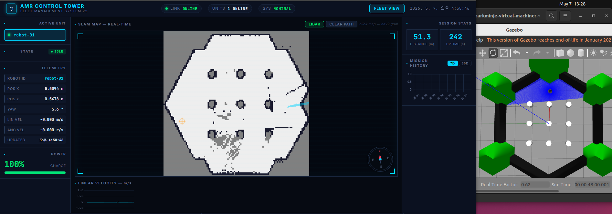

# AMR Control Tower

실시간으로 AMR(Autonomous Mobile Robot)을 모니터링·제어하는 산업급 Fleet 관제 플랫폼입니다.
ROS2 rosbridge를 통해 로봇 상태를 수집하고, WebSocket(STOMP)으로 대시보드에 실시간 반영합니다.

---

## 대시보드 미리보기

> SLAM 맵 실시간 오버레이 + LiDAR 스캔 + 로봇 위치 추적 + Gazebo 시뮬레이션 동시 실행



---

## 주요 기능

### 실시간 모니터링
- **SLAM 맵 오버레이** — slam_toolbox OccupancyGrid를 PNG로 렌더링, 5초 주기 업데이트
- **LiDAR 스캔 시각화** — `/scan` 토픽 실시간 포인트 클라우드 (HSL 거리 색상 코딩)
- **로봇 위치 추적** — `/tf` map→odom 변환 적용으로 정확한 맵 프레임 위치
- **방향 화살표** — quaternion → yaw 변환, 캔버스 좌표계 보정
- **나침반 위젯** — 실시간 yaw 기반 N/E/S/W 방위 표시
- **속도 추이 차트** — 최근 60초 선속도 실시간 라인 차트
- **배터리 상태** — 실시간 잔량 바 + 20% 이하 이벤트 자동 발행
- **멀티 로봇 탭** — 로봇별 탭 전환으로 독립 모니터링

### 로봇 제어
- **D-Pad 조이스틱** — 마우스 클릭 + 터치 지원 방향 제어
- **WASD / 방향키** — 키보드 실시간 `/cmd_vel` 발행 (100ms 루프)
- **속도 슬라이더** — 선속도(0.1~1.0 m/s) · 각속도(0.1~1.5 rad/s) 동적 조절
- **맵 클릭 → Nav2 목표** — Canvas 좌표를 world 좌표로 역변환 후 `/move_base_simple/goal` 발행
- **긴급 정지 (E-Stop)** — 즉시 zero twist + EMERGENCY_STOP 상태 전환
- **Resilience4j Circuit Breaker** — 명령 API 장애 격리

### Fleet 관리
- **Fleet 전체 뷰** (`/fleet`) — 전체 로봇 카드 그리드 + 개별 E-Stop
- **로봇 상태머신** — IDLE / MOVING / EMERGENCY_STOP / CHARGING / ERROR
- **이벤트 로그** — 배터리 저하, 장애물 감지, YOLO 감지, 목표 도달 실시간 이벤트
- **이벤트 ACK** — 확인 처리 (ackStatus, ackedAt)
- **주간/월간 주행 통계** — 일별 주행 거리 바 차트

### 인프라
- **MSA 구조** — Eureka 서비스 디스커버리 + Spring Cloud Gateway
- **Kafka 파이프라인** — 운영 환경 상태·이벤트 스트리밍
- **Prometheus 메트릭** — 배터리·이벤트 커스텀 메트릭 수집
- **YOLO REST 연동** — Python YOLO 노드 감지 결과 POST 수신

---

## 기술 스택

| 영역 | 기술 |
|------|------|
| Backend | Java 21, Spring Boot 3.2.4, Spring WebSocket (STOMP), Spring Data JPA |
| Frontend | Thymeleaf, Chart.js 4.4, SockJS, STOMP.js, Inter + JetBrains Mono |
| Database | H2 (dev), MySQL 8.0 (prod) |
| Message Broker | Apache Kafka 7.6 (Confluent) |
| MSA | Spring Cloud Eureka, Spring Cloud Gateway, Resilience4j |
| ROS2 | ROS2 Humble, rosbridge_suite, slam_toolbox, Nav2, TurtleBot3 Gazebo |
| Observability | Prometheus, Micrometer, Spring Actuator |
| DevOps | Docker, Docker Compose, Gradle 8.8 멀티모듈 |

---

## 아키텍처

```
브라우저 (대시보드 / Fleet 뷰)
    │  STOMP WebSocket  /topic/robot/{id}/*
    ▼
┌──────────────────────────────────────────────────────┐
│  amr-dashboard  :8080                                │
│                                                      │
│  RosBridgeClient ←─── rosbridge :9090 ←── ROS2       │
│    /odom  → onOdom()   → map 프레임 TF 보정          │
│    /scan  → onScan()   → LiDAR 다운샘플 (1/3)        │
│    /map   → onMap()    → OccupancyGrid PNG 변환       │
│    /tf    → onTf()     → map→odom 변환 캐시          │
│    /battery_state → onBattery()                       │
│                                                      │
│  RobotStatusService → STOMP push → 브라우저           │
│  RobotCommandService (CircuitBreaker)                 │
│    → /cmd_vel (D-Pad / WASD)                         │
│    → /move_base_simple/goal (맵 클릭 / 폼)           │
│                                                      │
│  MapController → GET /api/robot/{id}/map (PNG)       │
└──────────────────────────────────────────────────────┘
    │ Eureka 등록
    ▼
┌──────────────────┐     ┌──────────────────┐
│  Eureka  :8761   │     │  Gateway  :8000  │  ← 외부 진입점
└──────────────────┘     └──────────────────┘
```

| 프로파일 | DB | Kafka | Eureka | 진입점 |
|---|---|---|---|---|
| dev | H2 인메모리 | 비활성화 | 비활성화 | :8080 직접 |
| prod | MySQL | 활성화 | 활성화 | :8000 Gateway |

---

## 실행 방법

### 로컬 개발 (dev)

```bash
./gradlew bootRun
```

브라우저: `http://localhost:8080`

### Ubuntu ROS2 환경 (Gazebo 연동 시)

```bash
# 터미널 1 — TurtleBot3 Gazebo 실행
export TURTLEBOT3_MODEL=burger
ros2 launch turtlebot3_gazebo turtlebot3_world.launch.py

# 터미널 2 — SLAM toolbox (실시간 맵 생성)
ros2 launch slam_toolbox online_async_launch.py use_sim_time:=True

# 터미널 3 — rosbridge WebSocket 서버
ros2 launch rosbridge_server rosbridge_websocket_launch.xml
```

### Docker Compose (prod 풀스택)

```bash
docker compose up --build
```

| 서비스 | 포트 | 역할 |
|--------|------|------|
| api-gateway | **8000** | 외부 진입점 — 라우팅, Circuit Breaker |
| amr-dashboard | 8080 | 대시보드 서비스 본체 |
| eureka-server | 8761 | 서비스 디스커버리 |
| MySQL | 3306 | 상태·이벤트 영구 저장 |
| Kafka | 9092 | 로봇 상태 이벤트 스트리밍 |

---

## 로봇 설정

`application.yml`의 `rosbridge.robots` 리스트에 로봇을 추가합니다:

```yaml
rosbridge:
  reconnect-delay-ms: 3000
  robots:
    - robot-id: robot-01
      uri: ws://192.168.109.130:9090
      odom-topic: /odom
      battery-topic: /battery_state
      map-topic: /map
      scan-topic: /scan
```

---

## API 명세

### 조회

| Method | Endpoint | 설명 |
|--------|----------|------|
| GET | `/api/robot/list` | 등록된 로봇 ID 목록 |
| GET | `/api/robot/{id}/status/live` | 실시간 인메모리 상태 (robotState 포함) |
| GET | `/api/robot/{id}/stats/today` | 오늘 주행 거리 · 가동 시간 |
| GET | `/api/robot/{id}/stats/weekly` | 최근 7일 일별 주행 거리 |
| GET | `/api/robot/{id}/stats/monthly` | 최근 30일 일별 주행 거리 |
| GET | `/api/robot/{id}/events` | 최근 이벤트 20건 |
| GET | `/api/robot/{id}/map` | 최신 SLAM 맵 (PNG) |
| GET | `/api/robot/{id}/map/info` | 맵 메타데이터 (width, height, resolution, origin) |

### 제어

| Method | Endpoint | 설명 |
|--------|----------|------|
| POST | `/api/robot/{id}/command/estop` | 긴급 정지 |
| POST | `/api/robot/{id}/command/estop/clear` | 긴급 정지 해제 |
| POST | `/api/robot/{id}/command/goal` | Nav2 목표 전송 `{"x","y","theta"}` |
| POST | `/api/robot/{id}/command/velocity` | `/cmd_vel` 직접 발행 `{"linear","angular"}` |
| POST | `/api/robot/{id}/detection` | YOLO 감지 결과 수신 |
| POST | `/api/robot/{id}/events/{eventId}/ack` | 이벤트 ACK |

---

## WebSocket 토픽

| Topic | 설명 |
|-------|------|
| `/topic/robot/{id}/status` | 위치·속도·yaw·배터리·상태 실시간 |
| `/topic/robot/{id}/event` | 이벤트 발생 알림 |
| `/topic/robot/{id}/map` | SLAM 맵 업데이트 알림 (메타데이터) |
| `/topic/robot/{id}/scan` | LiDAR 스캔 포인트 (1/3 다운샘플) |

---

## 프로젝트 구조

```
amr-control-tower/
├── eureka-server/                     ← 서비스 디스커버리 (포트 8761)
├── api-gateway/                       ← API Gateway (포트 8000)
├── docs/
│   └── dashboard-preview.png          ← 대시보드 스크린샷
└── src/main/java/com/amr/dashboard/
    ├── config/
    │   ├── RosBridgeConfig.java        # 멀티 로봇 rosbridge 설정 (scan-topic 포함)
    │   └── WebSocketConfig.java
    ├── controller/
    │   ├── DashboardController.java
    │   ├── RobotApiController.java
    │   ├── CommandController.java      # /cmd_vel velocity 엔드포인트 포함
    │   ├── DetectionController.java
    │   └── MapController.java
    ├── ros/
    │   ├── RosBridgeClient.java        # odom/scan/map/tf/battery 구독
    │   └── RosBridgeManager.java
    └── service/
        ├── RobotStatusService.java     # TF 보정, 상태머신, LiDAR 처리
        ├── RobotCommandService.java    # cmd_vel, Nav2 goal
        ├── MapService.java             # OccupancyGrid → PNG
        ├── RobotMetricsService.java    # Prometheus 메트릭
        └── RobotStatsService.java
```

---

## 개발 현황

### 미니 프로젝트 (완료)
- [x] RosBridgeClient — rosbridge WebSocket 연결 및 토픽 구독
- [x] 멀티 로봇 Fleet 지원
- [x] 실시간 WebSocket 상태 푸시 (STOMP)
- [x] JPA + H2/MySQL 상태·이벤트 저장
- [x] Kafka 이벤트 파이프라인
- [x] Docker Compose 풀스택 배포

### Phase 1 — 제어·상태머신·Fleet (완료)
- [x] Ubuntu 22.04 + ROS2 Humble + TurtleBot3 Gazebo 연동
- [x] slam_toolbox OccupancyGrid 맵 실시간 오버레이
- [x] 로봇 상태머신 (IDLE / MOVING / EMERGENCY_STOP / CHARGING / ERROR)
- [x] 긴급 정지(E-Stop), Nav2 목표 지점 rosbridge publish
- [x] Fleet 전체 뷰 (`/fleet`)
- [x] YOLO REST 연동 엔드포인트
- [x] 이벤트 ACK 처리

### Phase 2 — MSA 구조 (완료)
- [x] Gradle 멀티모듈 (eureka-server, api-gateway, dashboard-service)
- [x] Spring Cloud Eureka Server — 서비스 레지스트리
- [x] Spring Cloud Gateway — lb:// 라우팅, Circuit Breaker 필터
- [x] Resilience4j @CircuitBreaker — 명령 API 보호
- [x] Prometheus 메트릭 + Actuator 엔드포인트

### Phase 3 — 실무급 로보틱스 기능 (완료)
- [x] LiDAR `/scan` 실시간 시각화 — HSL 거리 색상 포인트 클라우드
- [x] `/tf` map→odom 변환 구독 — 맵 프레임 정확도 보정
- [x] 로봇 방향 화살표 — quaternion→yaw, 캔버스 좌표계 회전 보정
- [x] 맵 클릭 → Nav2 Goal — 캔버스→world 역변환
- [x] 나침반 위젯 — N/E/S/W 실시간 방위 표시
- [x] D-Pad 조이스틱 + WASD 키보드 `/cmd_vel` 실시간 제어
- [x] 선속도·각속도 슬라이더 동적 조절
- [x] 산업급 다크 HUD UI 전면 재설계 — 3컬럼 레이아웃, Inter + JetBrains Mono
- [x] OccupancyGrid WebSocket 안정화 (throttle 5s, queue_length 1)
